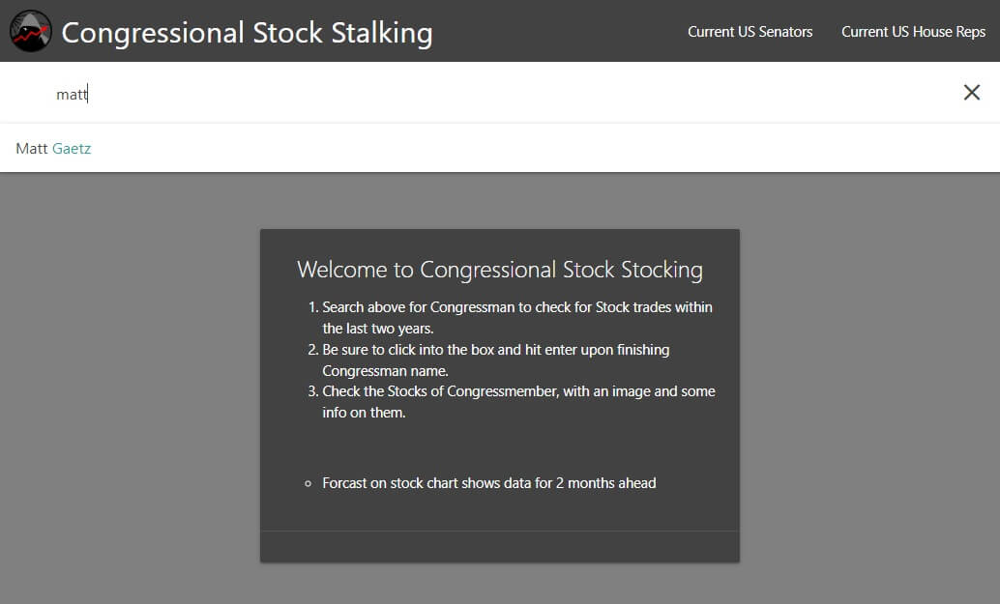
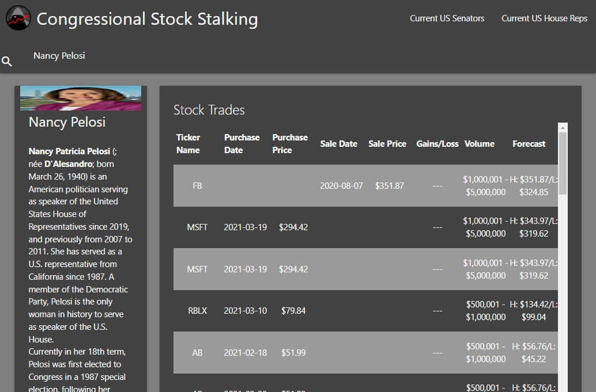

# Congress Stock Stalking

## Description

> With great power comes great responsibility

&nbsp;&nbsp;&nbsp;&nbsp;In the (dis)Information Age everyone appears to have skeletons, and it can be difficult to trust anyone. While the data supplied isn't perfect, the manditory stock disclosures help paint a strong picture of those representing us. By cross-referencing data from congress and stock price history, their actions are clear. More educated judgments can be made with more intimate knowledge.

## Installation

You can view the site [over here](https://axeljk.github.io/congress-stock-stalking).

## Usage

After the magnifying glass appears in the top bar, begin by clicking it and entering the name of a congressperson.

Once you've selected a congressperson, you should begin to see a table of their trades populate as well as a photo and blurb about them.

## Credits

- Aelin Rose
- Axel Kern
- Zane Sharif

## License

Copyright (c) The Creeps 2022

Licensed under the MIT license.